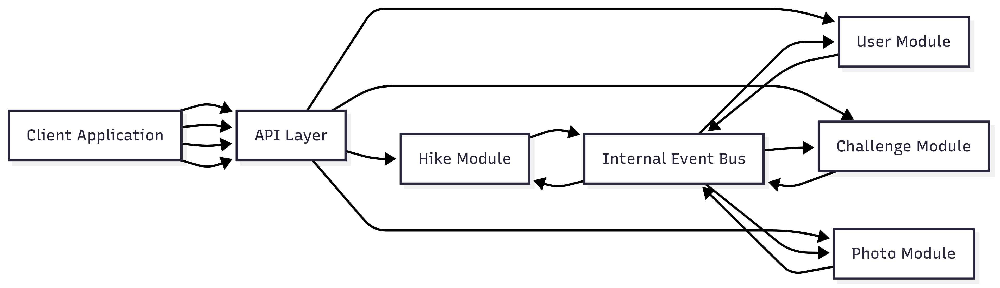

For instructions on running both the frontend and backend, refer to their respective README files.

## Architectural Proposal 

This architecture favors ease of implementation while maintaining clear boundaries and scalability for future growth. Instead of fully separate microservices, we implement a **modular monolith** with internal modules per bounded context and an optional **event bus** for decoupled communication.

###  Architecture Overview

- Modular Monolith:
    - Single deployment but organized into modules per bounded context: Hike, User, Challenge, Photo.
    - Each module owns its aggregates, entities, and repositories.
    - Modules communicate internally via method calls or asynchronously via an in-process event bus.

- Event-Driven Within Monolith:
    - Domain events are still published within the monolith to decouple modules.
    - External consumers (e.g., analytics) can subscribe to events if needed.

- Shared Database or Module-Specific Schemas:
    - Option 1: Single database with separate schemas per module.
    - Option 2: Single database with clearly separated tables per context.

- API Layer:
    - Expose endpoints for client apps (REST or GraphQL).
    - Routes requests to the appropriate module.

- Scalability & Extensibility
    - Can split modules into microservices later if needed.
    - Event-driven design allows for easy integration with external systems or analytics.

### 2. Technology Stack

| Layer                     | Technology / Pattern                           |
|----------------------------|-----------------------------------------------|
| Backend Framework          | Python (Django) or Node.js (NestJS)          |
| Frontend                   | React + TypeScript                            |
| In-Process Event Bus       | Built-in pub/sub or libraries (e.g., Django signals, EventEmitter in Node.js) |
| Database                   | PostgreSQL / MySQL                             |
| File Storage               | AWS S3 / Azure Blob Storage                   |
| Authentication & Authorization | OAuth2 / JWT                               |
| Containerization (Optional)| Docker                                       |

### 4. Event Flow Example

