Hikerz: A Social Hiking Network

Team 4:
Polly Dimieva
Sofia Dimieva
Filip-Andrei Cirtog
Bogdan-Luca Paramon

### Table of Contents

- [1. Problem Statement and Motivation](#1-problem-statement-and-motivation)
- [2 Problem analysis](#2-problem-analysis)
  - [2.1. Stakeholders and Context (Interest Map)](#21-stakeholders-and-context-interest-map)
  - [2.2. Context analysis](#22-context-analysis)
    - [2.2.1 Context problems](#221-context-problems)
    - [2.2.2 External Risks and Dependencies](#222-external-risks-and-dependencies)
  - [2.3. Vision articulation and identification of key functionality](#23-vision-articulation-and-identification-of-key-functionality)
    - [2.3.1. Identification of Key Functionality](#231-identification-of-key-functionality)
    - [2.3.2. Quality Attributes](#232-quality-attributes)
    - [2.3.3. Trade-offs](#233-trade-offs)
  - [2.4. Creation of Wardley Maps for Hikerz: From Genesis to Commodity](#24-creation-of-wardley-maps-for-hikerz-from-genesis-to-commodity)
    - [2.4.1 Introduction to Wardley Maps](#241-introduction-to-wardley-maps)
    - [2.4.2 Wardley Maps Analysis](#242-wardley-maps-analysis)
- [3. Event Storming Process](#3-event-storming-process)
  - [3.1. Steps](#31-steps)
  - [3.2. Event-to-Aggregate Mapping](#32-event-to-aggregate-mapping)
  - [3.3. Outputs from Event Storming](#33-outputs-from-event-storming)
  - [3.4. Cross-Context Dependencies](#34-cross-context-dependencies)
    - [3.4.1 Hike Context → User Context (`HikeLogged`)](#341-hike-context--user-context-hikelogged)
    - [3.4.2. Hike Context → Photo Context (`PhotoUploaded`)](#342-hike-context--photo-context-photouploaded)
    - [3.4.3 Photo Context → Hike Context (`PhotoUploaded`)](#343-photo-context--hike-context-photouploaded)
    - [3.4.4. Photo Context → User Context (`PhotoUploaded`)](#344-photo-context--user-context-photouploaded)
    - [3.4.5. User Context → User Context (`FriendAdded`, `FriendRemoved`, `FriendMapViewed`)](#345-user-context--user-context-friendadded-friendremoved-friendmapviewed)
    - [3.4.6. User Context → Challenge Context (`ChallengeJoined`, `ChallengeCompleted`)](#346-user-context--challenge-context-challengejoined-challengecompleted)
- [4. Pricing Models and Architectural Implications](#4-pricing-models-and-architectural-implications)
  - [4.1 Types of Pricing Models](#41-types-of-pricing-models)
    - [4.1.1 Subscription-Based Pricing](#411-subscription-based-pricing)
    - [4.1.2. Pay-Per-Use Pricing](#412-pay-per-use-pricing)
    - [4.1.3. Freemium Pricing](#413-freemium-pricing)
    - [4.1.4. Tiered Pricing](#414-tiered-pricing)
  - [4.2. Architectural Considerations Based on Pricing Models](#42-architectural-considerations-based-on-pricing-models)
    - [4.2.1. Flexibility and Adaptability](#421-flexibility-and-adaptability)
    - [4.2.2. Data Security and Compliance](#422-data-security-and-compliance)
    - [4.2.3. Performance and Scalability](#423-performance-and-scalability)
    - [4.2.4. Analytics and Reporting](#424-analytics-and-reporting)
    - [4.2.5. User Experience (UX)](#425-user-experience-ux)
  - [4.3. Conclusion](#43-conclusion)
- [5. Architecture Development and Design Decisions](#5-architecture-development-and-design-decisions)
  - [5.1. C4 Model](#51-c4-model)
    - [5.1.1. Context Diagram (C1)](#511-context-diagram-c1)
    - [5.1.2 Container Diagram (C2)](#512-container-diagram-c2)
    - [5.1.3. Components Diagram (C3)](#513-components-diagram-c3)
    - [5.1.4 Code Diagram (C4 – Activity Service Example)](#514-code-diagram-c4--activity-service-example)
  - [5.2. Sequence Diagrams](#52-sequence-diagrams)
    - [5.2.1 Scenario A — Create Hike](#521-scenario-a--create-hike)
    - [5.2.2 Scenario B — View “My Hikes”](#522-scenario-b--view-my-hikes)
    - [5.2.3 Scenario C — View “Friends’ Hikes”](#523-scenario-c--view-friends-hikes)
    - [5.2.4 Scenario D — Join Challenge](#524-scenario-d--join-challenge)
    - [5.2.5 Scenario E — Create Challenge](#525-scenario-e--create-challenge)
    - [5.2.6 Scenario F — View Statistics](#526-scenario-f--view-statistics)
  - [5.3 Proof-of-Concept Validation](#53-proof-of-concept-validation)
- [6. Elaboration of Specific Architectural Decisions and Alternatives](#6-elaboration-of-specific-architectural-decisions-and-alternatives)
    - [6.1 Tech Stack](#61-tech-stack)
    - [6.2 Architecture Styles](#62-architecture-styles)
      - [6.2.1 Microservices](#621-microservices)
    - [6.3  Separation of Concerns (SoC) Principle](#63--separation-of-concerns-soc-principle)
    - [6.4 Quality Assurance](#64-quality-assurance)
    - [6.5 RESTful HTTP APIs Response](#65-restful-http-apis-response)
      - [6.5.1. Context](#651-context)
      - [6.5.2. Chosen API Design Approach and Alternatives](#652-chosen-api-design-approach-and-alternatives)
- [7. Assessment of impact of Cloud vs On-Premises Deployment](#7-assessment-of-impact-of-cloud-vs-on-premises-deployment)
    - [7.1 PostgreSQL](#71-postgresql)
    - [7.2 Mapbox](#72-mapbox)
      - [7.2.1 Introduction:](#721-introduction)
      - [7.2.2 Table for Comparison](#722-table-for-comparison)
      - [7.2.3 Motivation:](#723-motivation)
      - [7.2.4 Cloud vs On Premises:](#724-cloud-vs-on-premises)
- [8. Critical Selection of Open Source Components](#8-critical-selection-of-open-source-components)
- [9. Event Communication Pattern](#9-event-communication-pattern)
  - [9.1 Comparative Analysis](#91-comparative-analysis)
    - [9.1.1. Publish-Subscribe with Redis Pub/Sub](#911-publish-subscribe-with-redis-pubsub)
    - [9.1.2. Producer-Consumer Queue (Redis Streams or RabbitMQ)](#912-producer-consumer-queue-redis-streams-or-rabbitmq)
    - [9.1.3 Event Bus within Modular Monolith (using Spring's ApplicationEventPublisher)](#913-event-bus-within-modular-monolith-using-springs-applicationeventpublisher)
    - [9.1.4, Direct HTTP/REST API Calls](#914-direct-httprest-api-calls)
    - [9.1.5. Shared Database with Polling](#915-shared-database-with-polling)
  - [9.2 Selected Pattern: Redis Publish–Subscribe](#92-selected-pattern-redis-publishsubscribe)
    - [9.2.1. Low-latency real-time updates](#921-low-latency-real-time-updates)
    - [9.2.2. Simple operational model for POC validation](#922-simple-operational-model-for-poc-validation)
    - [9.2.3. Privacy-driven selective event propagation](#923-privacy-driven-selective-event-propagation)
- [10. Proof of concept](#10-proof-of-concept)
  - [10.1 Structure](#101-structure)
  - [10.2. Experiment](#102-experiment)
    - [10.2.1. Performance Setup and Load Test Scenarios](#1021-performance-setup-and-load-test-scenarios)
    - [10.2.2. Metrics Considered](#1022-metrics-considered)
    - [10.2.3. Metrics Considered \& Expected results](#1023-metrics-considered--expected-results)
  - [10.3 Results](#103-results)
  - [10.4 Remaining risks and plans for future design iterations.](#104-remaining-risks-and-plans-for-future-design-iterations)
- [11. Use of Artificial Intelligence](#11-use-of-artificial-intelligence)
- [References](#references)

## 1. Problem Statement and Motivation

We propose a new outdoor hiking app named Hikerz which will record hiking routes on mobile applications. While currenttly similar platforms exist (like Strava or Komot), they only provide a series of features for activity tracking, mainly focused on running, cycling and swimming. Therefore, these platforms present the following three shortcomings:

1. Limited mountaineering focus in existing platforms: Current fitness and activity apps offering minimal support for mountaineering specific goals and instead focus on runners and cyclists.
2. Insufficient gamification and progression systems: Existing platforms focus on metrics rather than social connections
3. Lack of meaningful community engagement: Most apps fail to motivate users through structured challenges, achievement badges, or progression levels.

Hikerz aspires to serve both casual hikers seeking motivation and dedicated mountaineers striving toward regional peak goals. By addressing these shortcomings, Hikerz could attract a significant number of users from existing platforms like Strava, Komoot, and others.

---
## 2 Problem analysis

### 2.1. Stakeholders and Context (Interest Map)
In the **keep satisfied** section, we placed community organizers such as clubs or informal groups managing private or public hiking challenges togarher with local authorities such as municipal or regional entities interested in promoting local hiking trails and ensuring safety and environmental protection.

Next, we decided to **managed closely** our primary Users such as hikers, mountaineers, and outdoor enthusiasts seeking to record, share, and explore hiking routes.

We will **monitor (deploy minimum effor)** for amateur sports people such as casual hikers or fitness enthusiasts exploring trails occasionally and individuals using other fitness tracking platforms who might expand their activities to include hiking.

Lastly, we will **keep informed** individuals using the platform for educational purposes, such as geography or outdoor clubs and local business owners such as small businesses near popular trails that might benefit from exposure through the app.

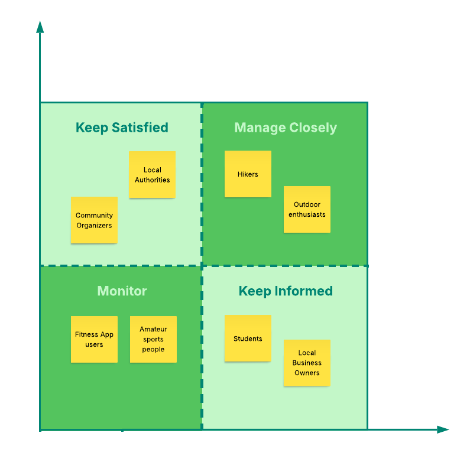  

### 2.2. Context analysis
Context captures all external elements that shape the design of Hikerz: users, competitors, regulations, and technical ecosystems. This section describes some of the factors that affect the app's architecture but are not directly related to its core functionality, such as external factors and market dynamics that shape its development.

#### 2.2.1 Context problems
| **Problem** | **Description** |
|--------------|-----------------|
| **Connectivity in the outdoors** | Connectivity in outdoor environments is often intermittent, requiring an design so users can record hikes and access key features without a strong internet connection. |
| **Competitive pressure** | Existing platforms like Strava and Komoot are already feature-rich, making it essential for Hikerz to differentiate itself through community-driven experiences, peak challenges, and gamification. |

#### 2.2.2 External Risks and Dependencies
| **Category**                    | **Description** |
|----------------------------------|-----------------|
| **Environmental Risks**          | As Hikerz operates in the outdoor space, it is dependent on weather and climate. |
| **Economic Risks**               | In times of economic downturns, spending on outdoor activities may decrease. |
| **Partnership Dependencies**     | Hikerz's ability to generate revenue from partnerships with commercial entities such as gear shops, local tourism boards, or map providers is crucial. |
| **Regulatory and Privacy Risks** | The outdoor activity tracking space is sensitive to privacy risks, as users may expose their home or work locations, creating potential security threats. |
| **Data Protection Regulations**  | The app must comply with data protection laws like GDPR. |
| **Market Competition and Adoption** | User adoption is crucial for Hikerz's success. If only a few users decide to switch to the platform, it risks lacking the necessary user engagement and content generation that would make the app valuable. |

### 2.3. Vision articulation and identification of key functionality

#### 2.3.1. Identification of Key Functionality

#### 2.3.2. Quality Attributes

- **Performance:** The app will deliver fast response times up to 1000 concurrent users and easy navigation to ensure a seamless user experience.  
- **Usability:** Hikerz will feature an intuitive and accessible interface, making it easy for users of all experience levels to explore and track their activities.  
- **Privacy and Security:** User data will be safeguarded through strong encryption and strict adherence to privacy regulations such as GDPR.  

#### 2.3.3. Trade-offs
- Privacy vs. Social Sharing: Offering privacy controls (e.g., private vs. public sharing of routes, photos, and stats) can limit the potential for broader social interaction or exposure.
- Feature Richness vs. Simplicity: Too many features could risk overwhelming casual users who just want a simple tracking app.
- Data Storage vs. Performance: Storing photos, route details, and trail statistics requires significant storage space, which may impact device performance

### 2.4. Creation of Wardley Maps for Hikerz: From Genesis to Commodity

#### 2.4.1 Introduction to Wardley Maps

In the context of Hikerz, an app that seeks to differentiate itself from existing platforms like Strava and Komoot, Wardley Maps ([Team, n.d.](#wardley)) can be a valuable tool in understanding the evolution of the app and plan the strategic direction. Below is an analysis of how the main elements of Hikerz may evolve over time, mapped from Genesis to Commodity.

#### 2.4.2 Wardley Maps Analysis

In the *genesis stage* Hikerz introduces new features that existing platforms lack, such as:

**Privacy-first controls** (for sensitive location data) and gamification tailored for mountaineers. At this stage, the app's market presence is limited, and the features are experimental. Some example components can be: **privacy-first location tracking** (custom solutions for ensuring the security of user data), **peak-focused gamification** (unique progression systems for mountaineers). Challenges of this stage are (having a) limited user base, experimental features, potential uncertainty around market fit.

**Offline-first design** takes in consideration that outdoor connectivity is unstable, Hikerz introduces an offline-first design that allows users to track their hikes even without a network connection. This approach can solve the common outdoor-specific problem, of losing progress due to signal interuptions. An example of a use case is **offline data logging and syncing**. As far as challenges go, the technology is still in the experimental stage, and there is a need for significant development and validation.

In the *custom-built stage* as the app gains some traction new features start appearing:

**Basic activity tracking** functionalities (logging routes, distances, and times) are being used by early adopters. At this point, the app provides a customized solution to a specific audience of hikers. A component can be for example **logging hikes** tracking of trails, difficulty, and hike statistics (distance, time). As a potential challenge while the app’s functionalities are established, it should still be further customized and it lacks wider adoption.

**Social features and a trusted social circle** implies that features like sharing hikes with friends and joining challenges are being developed. The app pushes the idea of sharing stats with your social circle, allowing users to connect and share their achievements with friends. For example a component could be **community creation and interaction** where private or small groups can share activities. Users can join peak-climbing challenges and compare performance with peers. Still an app revolving around a too specific niche, limited social network, but slowly improving user engagement.

In the *product stage* the app starts having standardized features like the following:

**Expanded tracking and discovery features** offering a more feature-rich platform with trail recommendations, route suggestions, and detailed statistics (average time for peak climbs, heart rate analytics, comparison to previous similar hikes for improvement analysis etc.). This is now a standardized product for a broader user base, beyond early adopters. It is to be expected that users **view more complex components per route**, detailed analytics and insights into hiking performance. However, competition from other fitness and hiking platforms trying to repeat and disrupt the pattern that our app followed intensifies as Hikerz moves closer to mainstream adoption.

**Monetization and partnerships** through deals with gear shops, tourism agencies, and map providers, while still remaining focused on its primary features, its privacy and specialized features for hikers. A component like **revenue generation from local businesses** (gear partnerships, travelling agencies, performance beverage/food companies etc.) will appear in this stage. Something that could be challenging is the fact that the monetization strategy must balance maintaining privacy and user trust. Credible partners with values that align with our stakeholder's values should be considered, and the contrary should be avoided.

In the *commodity stage*, the stage where the basic features become a standard and are expected, the app needs to stay competitive while mantaining the essential features:

**Basic activity tracking and map access**, which over time like any features that once made a difference, are now easily replicated by competitors or available as generic services. Competitive features like basic leaderboards may become expected utilities but less of a differentiator. However, Hikerz may still differentiate itself through its dense network. The component in this case would be **standardized hiking tracking** which does route logging and statistics, which are now present in most competitors from the same niche. This implies huge challenges since there is high competition and low differentiation.

By doing this analysis, the team can take multiple conclusions: - Genesis to Custom-Built: Focus on refining gamification and tracking features to attract early adopters. - Custom-Built to Product: Expand competitive and social features to appeal to a wider audience. - Product to Commodity: Continuously innovate competitive mechanics or personalized challenges to lead a market where basic tracking and gamification become standard.

---
## 3. Event Storming Process

The Event Storming process was used to identify domain events, commands, aggregates, policies, and their interactions. It created a shared understanding of system behavior and helped define the system’s bounded contexts.

The session involved two domain experts (experienced hikers), two developers, and one product owner. The workshop lasted 1 hour and 30 minutes.

A large wall or virtual board was used with color-coded sticky notes to represent system components:

- **Orange**: Domain Events (`HikeLogged`, `PhotoUploaded`)
- **Blue**: Commands (`StartHike`, `JoinChallenge`)
- **Green**: Aggregates/Actors (`HikeAggregate`, `UserAggregate`)
- **Purple**: Policies/Rules (`PrivateHikeCannotBeShared`)
- **Yellow**: External Systems (cloud storage, social media APIs)

### 3.1. Steps 

1. **Big Picture Timeline**  
   All domain events were mapped chronologically to show the flow from hike start to challenge completion.

2. **Identify Commands, Aggregates, and Policies**  
   Commands were linked to the events they triggered. Responsible aggregates were identified, and business rules were clarified.

3. **Mark Hot Spots**  
   Ambiguous or high-risk areas were highlighted, such as privacy rules, cross-context workflows, or scalability concerns.

4. **Define Candidate Bounded Contexts**  
   Initial context boundaries were proposed based on clusters of related events and aggregates.

5. **Validate Domain Events and Relationships**  
   Domain experts reviewed all identified elements to ensure completeness and accuracy.

### 3.2. Event-to-Aggregate Mapping

| Domain Event               | Triggering Command | Responsible Aggregate | Notes / Policies              |
| --------------------------- | ------------------ | --------------------- | ----------------------------- |
| `HikeStarted`              | `StartHike`        | HikeAggregate         | Start time recorded           |
| `HikePaused`               | `PauseHike`        | HikeAggregate         | Intermediate pause state      |
| `HikeFinished`             | `FinishHike`       | HikeAggregate         | End time recorded             |
| `HikeLogged`               | `LogHike`          | HikeAggregate         | Visibility depends on privacy |
| `PhotoUploaded`            | `UploadPhoto`      | PhotoAggregate        | Links to hike and user        |
| `FriendAdded`              | `AddFriend`        | UserAggregate         | Updates friendship invariants |
| `FriendRemoved`            | `RemoveFriend`     | UserAggregate         | Updates friendship invariants |
| `FriendMapViewed`          | `ViewFriendMap`    | UserAggregate         | Privacy rules enforced        |
| `ChallengeCreated`         | `CreateChallenge`  | ChallengeAggregate    | Rules for scoring established |
| `ChallengeJoined`          | `JoinChallenge`    | ChallengeAggregate    | Participant added             |
| `ChallengeProgressUpdated` | `UpdateChallenge`  | ChallengeAggregate    | Updates leaderboards          |
| `BadgeAwarded`             | `AwardBadge`       | UserAggregate         | Achievement recognition       |

### 3.3. Outputs from Event Storming

The Event Storming process resulted in a structured domain model that clearly defined entities, value objects, aggregates, and repositories. This structure established transactional boundaries, clarified data ownership, and outlined how different parts of the system interact. The model revolves around four main aggregates. The HikeAggregate represents individual hikes, including route, duration, difficulty, and privacy settings, and ensures that private hikes do not affect public data. The UserAggregate models user profiles, encompassing personal hikes, friendships, and statistics, while maintaining privacy and relationship rules. The ChallengeAggregate governs challenge definitions, participation, and progress tracking, enforcing the rules that determine scoring and completion. Lastly, the PhotoAggregate manages photo uploads, associated metadata, and their links to users and hikes.

Supporting these aggregates are the system’s entities and value objects. The primary entities include Hike, representing a single hiking activity; User, representing individual user profiles; Challenge, defining a specific challenge with participants and progress; Photo, storing images linked to hikes and users; and Badge, which records achievements awarded to users. The associated value objects capture detailed data used across the domain, such as GPXTrack for GPS routes and elevation data, Coordinate for geographic points, ElevationProfile for altitude information, PhotoMetadata for image details, and ChallengeProgress for tracking a user’s advancement in challenges.

To organize the system’s behavior, several bounded contexts were identified. The Hike Context is responsible for logging and tracking hikes through events like HikeStarted, HikePaused, HikeFinished, and HikeLogged. The User Context manages user profiles, friendships, and privacy settings, reacting to events such as FriendAdded, FriendMapViewed, and HikeLogged. The Challenge Context oversees the creation, participation, and progress tracking of challenges, responding to events like HikeLogged and FriendAdded. The Photo Context handles the storage and metadata of uploaded images, publishing PhotoUploaded events that are consumed by other contexts.

These contexts interact through asynchronous, event-driven communication. Each aggregate enforces its own local consistency, while updates between contexts rely on eventual consistency. This separation maintains a clear structure of ownership, reduces coupling, and ensures that the system remains scalable and adaptable to changes in domain behavior.

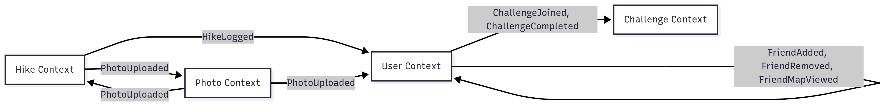

The diagram illustrates event-driven communication between contexts. Hike and Photo events update User and Challenge data, while User actions trigger updates across contexts. Each context remains decoupled through event publishing and consumption.

### 3.4. Cross-Context Dependencies

#### 3.4.1 Hike Context → User Context (`HikeLogged`)
When a hike is logged, the User Context updates user statistics such as total distance and completed hikes. The `HikeLogged` event is published by the Hike Context and consumed by the User Context.

#### 3.4.2. Hike Context → Photo Context (`PhotoUploaded`)
Hike operations trigger photo uploads handled by the Photo Context. This ensures centralized photo storage and metadata management linked to hikes.

#### 3.4.3 Photo Context → Hike Context (`PhotoUploaded`)
After a photo is uploaded, the Hike Context updates hike data such as timelines and maps. The event maintains links between photos and hikes.

#### 3.4.4. Photo Context → User Context (`PhotoUploaded`)
Photo uploads affect user profiles, updating photo histories and potentially triggering badges or achievements.

####  3.4.5. User Context → User Context (`FriendAdded`, `FriendRemoved`, `FriendMapViewed`)
User interactions, such as adding or viewing friends, remain within the same context. These events maintain friendships, privacy rules, and access permissions.

#### 3.4.6. User Context → Challenge Context (`ChallengeJoined`, `ChallengeCompleted`)
When users join or complete challenges, related events are sent to the Challenge Context. These update participants, progress, and leaderboards through the `ChallengeAggregate`.

---
## 4. Pricing Models and Architectural Implications

In today’s competitive marketplace, the choice of a pricing model significantly impacts not only the revenue strategy but also the underlying architecture of the systems that support it. A pricing model dictates how companies charge for their products or services, and the architecture must align with these strategies to ensure seamless operations and scalability. This section explores the relationship between pricing models and architectural decisions, highlighting the importance of aligning both for robust business solutions.

### 4.1. Types of Pricing Models

#### 4.1.1. Subscription-Based Pricing

Subscription-based pricing, often used in SaaS (Software as a Service), charges customers a recurring fee (monthly or annually) for access to a product or service. It’s a popular choice for services that offer continuous value, as it provides predictable revenue streams.

**Architectural Implications:**
The system must be designed to handle scalability challenges as it accommodates varying levels of usage across different stages of the customer lifecycle, from initial onboarding through long-term retention. Seamless integration with recurring payment systems is essential to ensure uninterrupted service delivery and reliable revenue collection. Furthermore, the architecture must support sophisticated user management capabilities that can handle complex subscription tiers, automatic renewals, and customer-initiated cancellations while maintaining data integrity and service continuity.

#### 4.1.2. Pay-Per-Use Pricing

Pay-per-use models charge customers based on their actual usage, common in cloud services and utilities. This model allows businesses to charge according to consumption, making it a flexible option for both customers and providers.

**Architectural Implications:**
The system requires real-time monitoring capabilities to track usage metrics accurately, ensuring precise billing for all services consumed. To accommodate fluctuating demand patterns, the architecture must support elastic infrastructure that can scale resources dynamically based on current needs. Additionally, efficient storage and retrieval mechanisms for usage data are critical components, as they enable accurate billing calculations and comprehensive reporting across the platform.

#### 4.1.3. Freemium Pricing

The freemium model offers basic features for free and charges for advanced functionalities. It’s used to attract a large user base with the intent to convert free users into paying customers.

**Architectural Implications:**
The system must implement clear feature segmentation to effectively separate free offerings from premium services, ensuring distinct value propositions for each tier. Comprehensive analytics capabilities are essential to collect and analyze user behavior data, enabling the optimization of the freemium-to-paid conversion flow through data-driven insights. Additionally, a smooth transition mechanism from free to paid accounts is necessary, requiring robust integration with payment systems to minimize friction during the upgrade process and maximize conversion rates.

#### 4.1.4. Tiered Pricing

Tiered pricing allows customers to choose from different pricing packages based on the level of service or functionality they need. Each tier provides more advanced features, catering to different customer segments.

**Architectural Implications:**
The system must adopt a modular design approach that allows for seamless enabling or disabling of features based on each customer's pricing tier, ensuring flexibility and maintainability. Customer profiles need to be structured to clearly differentiate users based on their selected pricing tier, enabling personalized experiences and appropriate access controls. Additionally, the system must be capable of implementing complex pricing logic that can accurately calculate charges based on the user's selected tier, accommodating various pricing structures and promotional offerings while maintaining accuracy and consistency.

---

### 4.2. Architectural Considerations Based on Pricing Models

#### 4.2.1. Flexibility and Adaptability

The architecture must support flexibility to adapt to changing pricing models. Businesses may need to pivot to a new pricing strategy as they grow, so the system should be modular and easy to adjust without a complete overhaul.

#### 4.2.2. Data Security and Compliance

For pricing models involving recurring payments or personal data, security is crucial. The architecture must integrate robust encryption, secure payment gateways, and comply with regulations like GDPR or PCI-DSS to protect customer data.

#### 4.2.3. Performance and Scalability

Different pricing models experience varying traffic demands. A subscription model may face predictable usage spikes, while pay-per-use models might have more irregular traffic patterns. The architecture should scale horizontally, using cloud-based solutions to ensure consistent performance during high demand.

#### 4.2.4. Analytics and Reporting

To optimize pricing strategies, businesses need to track metrics like customer lifetime value (CLV), conversion rates, and churn. The system must incorporate robust data analytics and reporting tools to provide insights into user behavior, enabling businesses to fine-tune their pricing models and improve revenue generation.

#### 4.2.5. User Experience (UX)

The user experience should align with the chosen pricing model. For instance, a pay-per-use model needs transparent billing and usage tracking, while subscription-based models must provide users with an easy way to manage their subscriptions. A seamless user experience ensures customer retention and reduces friction, particularly when transitioning between different pricing tiers or subscription plans.

---

### 4.3. Conclusion

The choice of pricing model directly affects the design and scalability of the system architecture. Whether adopting subscription-based, pay-per-use, freemium, or tiered pricing, the system must be designed to accommodate the specific requirements of each model. Scalability, flexibility, security, and user experience are all key architectural considerations that must align with the pricing strategy to ensure a seamless and efficient business solution. By understanding the architectural implications of each pricing model, businesses can create solutions that not only support growth but also enhance user satisfaction and operational efficiency.

---
## 5. Architecture Development and Design Decisions

### 5.1. C4 Model

To effectively communicate and document the system’s architecture, the C4 model was adopted. The C4 model provides a structured and hierarchical way to visualize software architecture at different levels of detail, ensuring clarity and alignment across technical and non-technical stakeholders. It breaks down the system into four key diagram types: Context, Container, Components, Code. 

#### 5.1.1. Context Diagram (C1)
The Context Diagram offers a high-level overview of the system and its interactions with external users and systems.
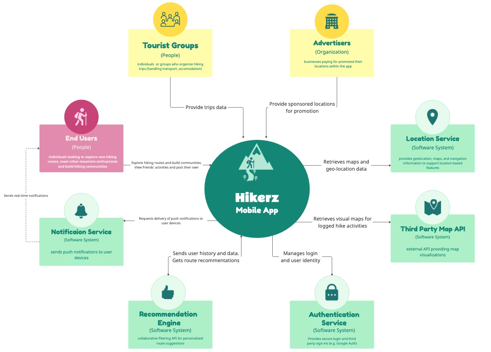
This Context diagram shows the Hikers Mobile App and its relationship with the end-users and key external systems, establishing the system's purpose and scope.

The Hikers Mobile App is a system designed to connect individuals (End Users) looking to explore new hiking routes, meet other enthusiasts, and build hiking communities. The application acts as a central hub, interacting with various users and external services to deliver its core features.

The primary stakeholders of the Hikerz app include three distinct user groups, each contributing great value to the platform. End Users represent the core audience—individuals who actively explore hiking routes, share their experiences, view friends' activities, and participate in building hiking communities. Tourist Groups, encompassing both organized groups and independent travelers, provide valuable trip-related data such as transportation options and accommodation recommendations, enriching the app's utility for planning complete hiking experiences. Additionally, Advertisers serve as commercial stakeholders, representing businesses that invest in promoting their locations within the app by providing sponsored locations, creating revenue opportunities while offering users relevant local services.

The system's functionality relies heavily on integration with several critical external systems that provide specialized capabilities beyond the core application's scope. The Location Service's purpose is to provide essential geographical capabilities, including geolocation, maps, and navigation information to support location-based features. Complementing this, the Third Party Map API serves as a dedicated visual mapping solution, providing rich, interactive maps that display hiking routes and logged activities in an engaging manner. Real-time user engagement is facilitated through the Notification Service, which manages the delivery of push notifications to user devices, ensuring timely updates about friend activities, challenge progress, and important app communications. The platform's intelligence is enhanced by the Recommendation Engine, a collaborative filtering system that analyzes user preferences and behaviors to provide personalized route suggestions, helping users discover new trails aligned with their interests and skill levels. Finally, the Authentication Service manages secure user identity and access control, supporting login methods including trusted third-party authentication providers such as Google, ensuring both security and user convenience in the registration and login processes.

#### 5.1.2 Container Diagram (C2)
The purpose of the Container Diagram is to illustrate the main containers (such as web applications, databases, APIs, etc.) that make up the system and how they communicate.

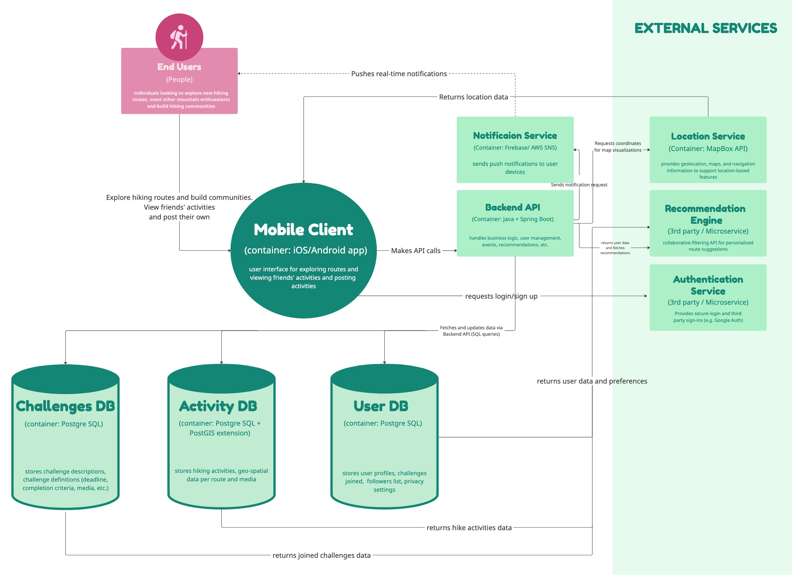

The system consists of several core components. The Mobile Client (iOS/Android app) serves as the user-facing application for exploring routes, viewing friends’ activities, and posting new ones. It communicates with the Backend API, built with Java and Spring Boot, which manages business logic, user accounts, events, and recommendations. The Backend API coordinates interactions between the Mobile Client, databases, and external services.

Data is organized into multiple PostgreSQL databases: the User DB stores user profiles, challenges, follower lists, and privacy settings; the Activity DB, enhanced with the PostGIS extension, stores hiking activities and geospatial data such as routes and media; and the Challenges DB contains information about challenge descriptions, deadlines, and completion criteria.

Several external services support the system. The Notification Service (Firebase or AWS SNS) delivers push notifications to users and assists with map coordinate retrieval. The Location Service (Mapbox API) provides maps, geolocation, and routing features for both the Mobile Client and the Backend API. A Recommendation Engine offers personalized route suggestions using collaborative filtering based on user data and preferences, while an Authentication Service ensures secure login and identity management for users.

#### 5.1.3. Components Diagram (C3)

The Component diagram details the internal structure of the Backend API, demonstrating a clear Layered Architecture (Controllers, Services, Repositories) and the decomposition into functional components (e.g., User, Activity, Challenge).

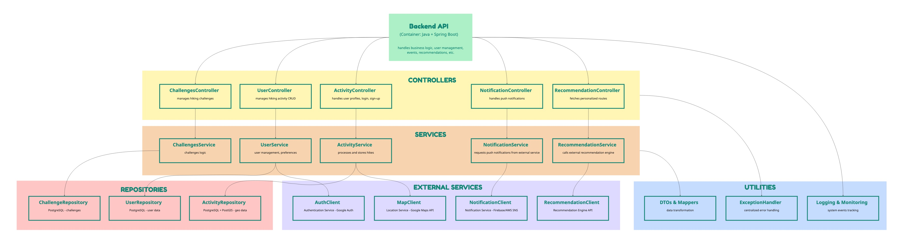

The system follows a layered architecture designed for clear separation of concerns and maintainability. The Controllers Layer at the top exposes API endpoints through components such as UserController, ActivityController, ChallengeController, NotificationController, and RecommendationController.

The Services Layer in the middle contains the core business logic, implemented in services like UserService, ActivityService, ChallengeService, NotificationService, and RecommendationService. These services interact with repositories for data access and with dedicated clients for communication with external systems.

The Repositories Layer, located at the bottom left, manages persistence and database operations. Components such as UserRepository, ActivityRepository, and ChallengeRepository abstract database interactions with PostgreSQL, ensuring flexibility and modularity.

The Utilities Layer, at the bottom right, provides cross-cutting functionality, including data transformation (DTOs and mappers), error handling (ExceptionHandler), and logging and monitoring tools.

Finally, the External Service Clients at the bottom center facilitate integration with third-party systems, maintaining clean separation between internal and external logic. These include AuthClient for authentication services (Google/Auth), MapClient for the Mapbox Location Service, NotificationClient for Firebase or AWS SNS, and RecommendationClient for the Recommendation Engine API.

#### 5.1.4 Code Diagram (C4 – Activity Service Example)

The Code diagram provides a detailed view of a specific component, the Activity Service, showing its classes and implementation details. This demonstrates the adopted Domain-Driven Design (DDD) principles and persistence framework (Spring/JPA).

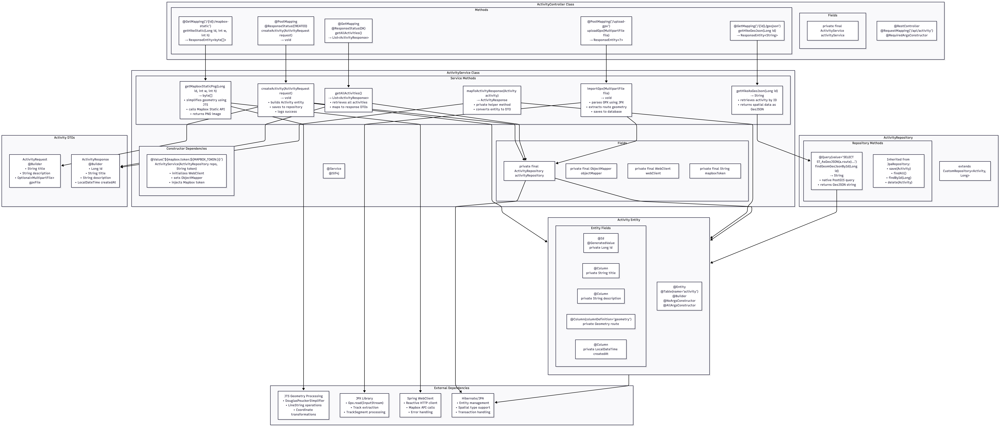

The system’s core logic is organized into several key classes and artifacts. The ActivityController defines the public API endpoints using annotations like @GetMapping and @PostMapping, exposing methods such as getActivityById, submitActivity, and getAllActivities as entry points for client requests. The ActivityService class contains the main business logic, implementing methods like getActivities, submitActivity, and deleteActivity. It coordinates operations between the controller and the data layer. The ActivityRepository interface extends Spring Data JPA to provide CRUD and query operations such as findByUserId and save, abstracting database interactions.

The ActivityEntity class defines the persistent data model, with fields such as title and geojson, and uses JPA annotations like @Entity and @Id for object-relational mapping. Data exchange between the service layer and clients is handled through DTOs (Data Transfer Objects) such as ActivityDTO and ActivitySummaryDTO, ensuring encapsulation and clear separation of concerns.

The implementation relies on several technical dependencies. Hibernate (JPA Library) is used for object-relational mapping, Spring Boot provides dependency injection, transaction management, and streamlined configuration, and JTS Geometry Processing libraries support geospatial data handling in conjunction with the PostGIS extension.

### 5.2. Sequence Diagrams
The system’s dynamic behavior is modelled by Sequence Diagrams. 
These diagrams capture runtime interactions among users, frontend, backend 
microservices, databases, and external APIs, illustrating how the architecture supports 
functional requirements and quality attributes such as performance, scalability, and 
separation of concerns. Each diagram represents a core user-driven scenario in the Hikerz 
system. By decomposing them individually, we highlight service responsibilities and 
boundaries while maintaining traceability to the problem statement and architectural 
decisions.  

#### 5.2.1 Scenario A — Create Hike  

This diagram shows the flow when a user logs a new hike by submitting metadata (title, 
distance, difficulty) and attachments (GPX + image). 
The Activity Service validates input, parses the GPX file into geometry, stores the hike in 
PostgreSQL/PostGIS, and returns a confirmation response to the frontend. 
Optionally, a HikeLogged event is published to Redis for asynchronous updates to statistics 
and leaderboards.  

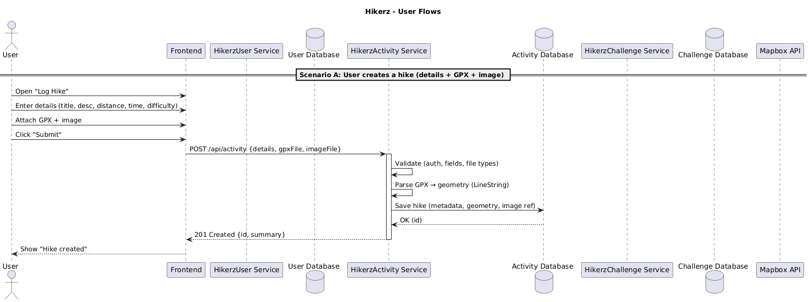  
*Figure 1: Sequence diagram for the "Create Hike" scenario.*

#### 5.2.2 Scenario B — View “My Hikes”  
For the user to view their previously logged hikes, the Frontend requests the list of hikes 
from the Activity Service, which queries the Activity Database and returns paginated results. 
For each hike, GeoJSON route data is fetched separately and rendered interactively via 
Mapbox, ensuring efficient data transfer and scalable rendering. 
This process allows the user to visually explore their activity history with minimal loading 
time.  

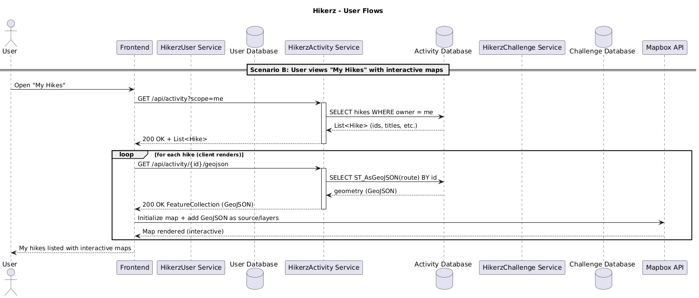  
*Figure 2: Sequence diagram for the "View My Hikes" scenario.*

#### 5.2.3 Scenario C — View “Friends’ Hikes” 
For the user to discover hikes shared by friends, the Frontend first retrieves the friend list 
from the User Service, then queries the Activity Service for public or friend-visible hikes. 
Each route is fetched as GeoJSON and rendered through Mapbox, while privacy filtering is 
enforced server-side. 
This flow demonstrates how cross-service data retrieval supports community-based features 
while maintaining secure visibility rules.  

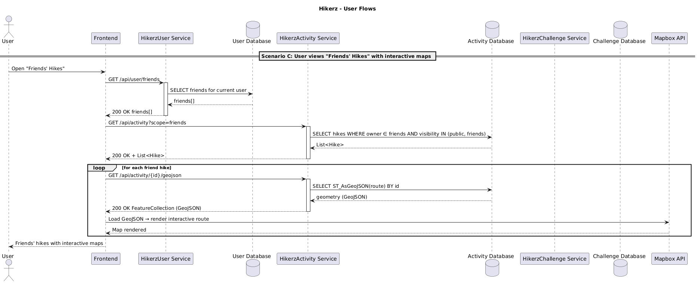  
*Figure 3: Sequence diagram for the "View Friends’ Hikes" scenario.*

#### 5.2.4 Scenario D — Join Challenge  
For the user to participate in an active challenge, the Frontend sends a request to the 
Challenge Service, which records the user’s participation in the Challenge Database. 
The User Service is then updated to reflect the new joined challenge. 
This sequence highlights controlled data consistency and interaction between the Challenge 
and User bounded contexts.  

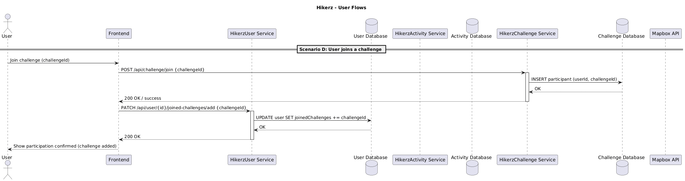  
*Figure 4: Sequence diagram for the "Join Challenge" scenario.*

#### 5.2.5 Scenario E — Create Challenge
For the user to create a new challenge, the Challenge Service validates the input data and 
stores the new challenge in the Challenge Database. 
It then triggers an update in the User Service to associate the challenge ownership with the 
creator. 
This scenario demonstrates the enforcement of the Separation of Concerns (SoC) principle, 
ensuring clean ownership boundaries across services.  

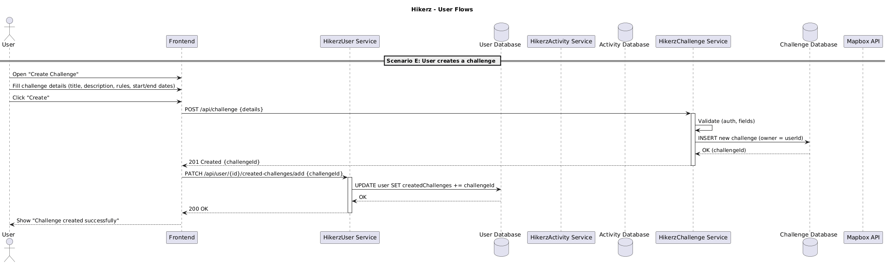  
*Figure 5: Sequence diagram for the "Create Challenge" scenario.*

#### 5.2.6 Scenario F — View Statistics  
For the user to analyze their hiking performance, the Frontend requests aggregated statistics 
from the Activity Service. 
The service executes spatial and numerical aggregations directly in PostGIS, returning a 
summary JSON object containing total distance, elevation gain, and average pace. 
The frontend visualizes this data locally through charts and summaries, providing an 
interactive performance dashboard with minimal latency.  

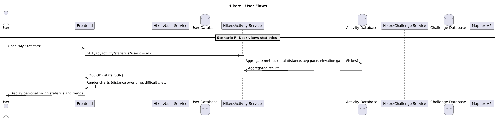  
*Figure 6: Sequence diagram for the "View Statistics" scenario.*

### 5.3 Proof-of-Concept Validation
In the following sections, we make some important decisions involving the architectural design of the app. As a result, this choices need to be measured. Therefore, we continue by creating a PoC (Proof of Concept) on which we perform certain experiments. Some evaluations were manual (e.g. verifying that the backend can render a map via a third-party service and display a user’s hike), while others were automated stress tests simulating scalability, latency, and resilience. As detailed in the final section, the experimental results validate the assumptions made in our initial design.

---
## 6. Elaboration of Specific Architectural Decisions and Alternatives

#### 6.1 Tech Stack
Because of its extensive JVM maturity, we came to the conclusion that SpringBoot is the ideal option for enterprise backends operating at production scale. This guarantees robust stability, continuous updates/patches (due to massive adoption), and a reliable, comprehensive ecosystem. Furthermore, Spring Boot provides great Out Of The Box features and extensions that directly address the Hikerz architectural requirements. Additionally, for spatial tasks like PostGis requests, which hikers will depend on, the majority of the alternatives under consideration offer poor scalability. React Native will be used for the PoC in order to integrate with mobile devices and be able to showcase our backend design choices.

| **Option** | **Advantage** | **Trade-off** |
|-------------|----------------|----------------|
| **Option 1 (Chosen): Spring Boot (JVM)** | Mature enterprise ecosystem (JPA, Security, Observability) and strong CPU performance for PostGIS analysis. | Higher memory use and slower startup compared to Go or Node.js. |
| **Option 2: Python (Django)** | Fast prototyping and simple, readable syntax for quick iteration. | Limited concurrency and performance for CPU-heavy spatial tasks (PostGIS). |
| **Option 3: Go (Gin/Chi/Fiber)** | Excellent raw performance and lightweight concurrency with goroutines. | Lacks built-in enterprise features; requires manual integration. |
| **Option 4: Node.js (NestJS)** | Great for rapid development of I/O-bound services. | Single-threaded model limits CPU-heavy spatial scalability (PostGIS). |

#### 6.2 Architecture Styles  

##### 6.2.1 Microservices
For Hikerz, the choice of architecture was a critical decision. We selected a microservices architecture because it offers significant advantages in scalability, modularity, and independent deployment per domain (User, Activity, Challenge) which makes it suitable for our use case. To manage initial complexity, we adopted a "MonolithFirst" strategy by allowing for a modular monolith fallback, a practice advocated by Fowler (2015) as a pragmatic path toward a microservices-based system. This approach aligns with our strategic goals to support interactive maps, independently scale geospatial workloads, and evolve components without redeploying the entire system.  

While a pure monolith simplifies initial deployment and testing, it often limits long-term flexibility and growth. A modular monolith offers a strong middle ground, but it still ties all modules into a single runtime. As detailed by Newman (2021), microservices provide maximum modular autonomy and granular scalability at the cost of greater operational overhead. This trade-off includes managing challenges such as service discovery, inter-service latency, and distributed data consistency, which we plan to address with a dedicated platform infrastructure.  

#### 6.3  Separation of Concerns (SoC) Principle
Separation of Concerns (SoC) is a software design and engineering discipline that attempts to break down challenging systems into easier, more comprehensible pieces. The idea is to organize a system's parts in a manner that every piece is responsible for a single concern, or an integrated aspect of functioning, without combining concerns. By doing so, SoC enhances the system’s modularity, maintainability, and scalability. We adhere to this principle in the Hikerz codebase. While the service houses the functional logic, the controller serves as the point of entry for requests. In order to facilitate a clean architecture and decouple the internal model from the external API representation, the result of retrieving entities from the repository is mapped to a Data Transfer Object (DTO).

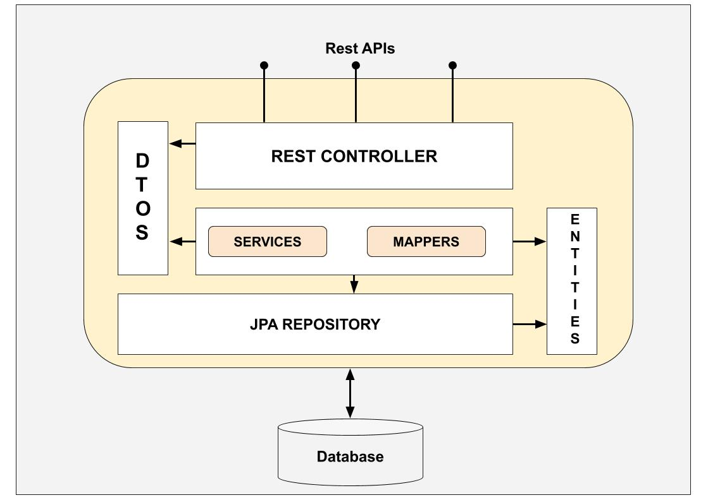

#### 6.4 Quality Assurance
Quality assurance in the Hikerz project focuses on ensuring reliability, stability, and correctness across the components which form the system. The project employs 7 different methods to ensure quality assurance: Unit testing, Postman API Testing, Manual Testing, Stress/Load Testing, CI/CD Pipeline integration and Staging Environment. Unit tests, created using JUnit, Mockito, and Spring Boot, confirm that separate backend elements, like controllers and services, operate as intended when used alone. Postman is used for testing and validating RESTful APIs. It helps ensure the backend API endpoints are functioning correctly, with the right responses and status codes. By enabling developers to engage directly with the application, manual testing concentrates on usability, user experience, and edge cases that automated testing might miss. Integration tests ensure backend responses match frontend expectations. The CI/CD pipeline ensures reliable delivery and quick feedback by automated building, testing, and deployment using Gitlab’s release process.The k6 stress and load testing assesses how well the system performs under high usage, confirming that it can continue to be scalable, responsive, and stable even during periods of the peak weekend demand. Lastly, Hikerz implements a staging environment in which new features and updates are deployed before reaching production to ensure a release process.

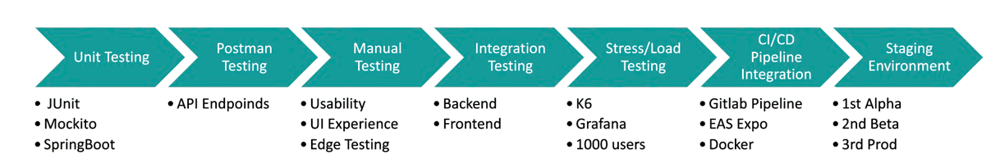     

#### 6.5 RESTful HTTP APIs Response 

##### 6.5.1. Context
As Hikerzs’ quality attributes focus on performance and scalability, when designing the RESTful HTTP APIs for the microservices, an important architectural decision was made on how to handle the retrieval of large datasets: Paginated Responses versus Bulk Fetching (non-paginated). As explained by [Gowda et al.](#pagination), pagination partitions large result sets into smaller, more manageable pages. According to the [ALF Design Group](#alf-pagination-table-design), this approach not only enhances performance but also improves accessibility and enables easier navigation and comparison.

##### 6.5.2. Chosen API Design Approach and Alternatives
The paginated approach retrieves data in smaller, manageable chunks called pages, which improves performance and resource management when dealing with large datasets. Our standard configuration fetches 10 users per page. When the user scrolls through the list of registered users to find people to follow, an additional 10 users are automatically fetched once the user reaches the end of the currently loaded list. If the user enters a search query, the same incremental loading process applies, but the results are filtered by the server based on the provided query. The main advantages consist of smaller data payloads and faster response times with lower latency, reduced server memory usage with lower database load and less bandwidth consumption. Paginated responses should allow the server to handle large datasets efficiently even under high load.

The bulk fetching approach retrieves the entire collection of data in a single HTTP response. While this method eliminates the need for multiple round trips to the server and may reduce latency for smaller datasets, it is increasingly inefficient and memory-intensive with high volume, the one the Hikerz app is expected to interact with. Large responses increase both load times and client-side rendering. This degrades user experience and increases the bandwidth usage. When a user enters a search query, the same bulk loading process applies, but the server filters the results based on the provided query. The main drawbacks of this approach consist of the possibility to  monopolize server resources which can lead to user-facing timeouts. Furthermore, this increases the risk of high memory and CPU utilization on both the server and the client.

---
## 7. Assessment of impact of Cloud vs On-Premises Deployment

#### 7.1 PostgreSQL

An essential architectural decision for Hikerz concerned the deployment 
model for persistent data storage across its microservices (User, Activity, and 
Challenge). The decision had to balance performance, scalability, cost, and 
geospatial query efficiency, given Hikerz’s heavy reliance on map-based 
functionality and spatial analysis.

The evaluation considered three primary options: Amazon S3 (Cloud Object 
Storage), a Cloud Relational Database Service (AWS RDS for PostgreSQL), 
and a dedicated On-Premises PostgreSQL deployment. Each option was 
assessed for its ability to support Hikerz’s core requirements for 
ACID-compliant transactions, complex spatial queries, and low-latency data 
access.

Amazon S3 was initially considered for its scalability, durability, and low 
operational cost . However, as an object storage service, S3 
lacks the transactional and relational capabilities required for user data, hikes, 
and challenges. It does not enforce ACID properties or support SQL queries 
and geospatial operations , making it unsuitable 
as a primary data store. While S3 performs well for static assets such as images 
or GPX files, it cannot replace a relational database for dynamic, 
query-intensive data.

Cloud RDBMS solutions such as AWS RDS for PostgreSQL were also 
evaluated for their elasticity and reduced administrative burden. Managed services automate replication, 
scaling, and backups, simplifying deployment. However, these benefits come 
at the cost of limited configuration control, potential vendor lock-in, and 
variable network latency. For Hikerz, this lack of fine-grained tuning is 
critical, especially for PostGIS-based spatial queries that must execute in 
milliseconds to support map rendering and route visualization.

Ultimately, Hikerz adopted an on-premises PostgreSQL deployment model, 
assigning a dedicated instance to each microservice. This approach provides 
complete control over the database configuration, hardware allocation, and 
indexing strategy, ensuring predictable performance and low-latency access. 
The ability to directly optimize PostGIS and manage data locality gives 
on-premises PostgreSQL a significant advantage for geospatially intensive 
workloads . While this decision increases initial setup 
and maintenance costs, it ensures long-term scalability, compliance, and 
autonomy over the system’s most critical data layer.

Criterion | Amazon S3 (Cloud Object Storage) | Cloud RDBMS (AWS RDS for PostgreSQL) | On-Premises PostgreSQL
---|---|---|---
Type | Object storage | Managed relational database | Self-managed relational database
Data Model | Key-value (unstructured) | Structured, relational | Structured, relational
Transactional Support | Not supported  | Supported | Supported
Geospatial Capabilities | None | PostGIS supported (limited tuning)  | Full PostGIS support with hardware-level tuning 
Performance and Latency | Optimized for storage, not query performance | Moderate, network-dependent  | High performance, low latency 
Scalability | Extremely high  | High (automated scaling) | Scalable with manual configuration
Control and Customization | Minimal | Limited (provider templates) | Full administrative and hardware control 
Cost Model | Low operational cost | Moderate recurring cost  | Higher initial cost, lower long-term operational cost 

#### 7.2 Mapbox

##### 7.2.1 Introduction:

Mapbox is a platform for custom mapping and location-based services. It offers tools for developers to create interactive maps, visualizations, and other geolocation services. It provides APIs and SDKs ([Mobile Maps in 3D for iOS and Android, n.d.](#mapbox)) for mapping, navigation, and location tracking, and enables developers to design custom map styles, generate routes, and analyze geospatial data. In the following section, Mapbox will be compared with other popular mapping providers using several resources for our research such as this Wikipedia ([Wikipedia contributors, 2025](#wiki)) page, its links and imbircated sources. This will be done rigorously by considering the following criteria: Data, Trail Visualization, Styling, Ecosystem, Cost, Offline Support, and Popularity. All of these criteria will be evaluated with the needs of our application in mind.

##### 7.2.2 Table for Comparison

| **Criteria**            | **Mapbox**                                 | **Google Maps**                         | **Leaflet**                                   | **ESRI**                             |
| ----------------------- | ------------------------------------------ | --------------------------------------- | --------------------------------------------- | ------------------------------------ |
| **Data**                | OSM-based, customizable                    | Proprietary, huge coverage              | Depends on source (OSM, tileservers)          | Proprietary, extremely detailed      |
| **Trail Visualization** | Customizable lines, heatmaps, 3D terrain   | Limited styling; strong default terrain | Polylines, heatmaps via plugins; no native 3D | Full GIS analysis, terrain, contours |
| **Styling**             | Full vector tile styling, interactive      | Minimal custom styling                  | Custom styling possible but less smooth       | Very advanced but enterprise-focused |
| **Ecosystem**           | SDKs for web, iOS, Android; good docs      | Great mobile SDKs, strong geocoding     | Lightweight JS; plugins vary in quality       | Enterprise SDKs; heavy               |
| **Cost**                | Usage-based pricing; free tier for dev     | Expensive at scale                      | Expensive at scale                            | Expensive licenses                   |
| **Offline Support**     | Yes (with Mapbox SDKs)                     | Limited                                 | Requires custom setup                         | Yes (ArcGIS packages)                |
| **Popularity**          | Used by Strava, Komoot, AllTrails → proven | Less common in sports apps              | Used in smaller projects                      | Used in gov/enterprise apps          |

##### 7.2.3 Motivation:

Analyzing those key aspects clearly outlines the most suitable option for the project as being Mapbox. Every aspect meets the criteria required for the application. In terms of data, Google Maps seemed like the obvious choice due to its extensive coverage; however, after further research, we found that the difference in coverage mainly refers to cities and rural areas. If the matter is isolated to the concerns of our application, trails are finite and somewhat already defined by paths, unlike extensive unexplored surfaces like rural areas or entire cities. This motivated us to opt for an OSM-based solution. It is to our advantage to use the OpenStreetMap service, which is open source and allows hikers to contribute, thus increasing the coverage of trails. Proprietary sources, such as Google Maps, do not allow external users to enrich their dataset.

Trail visualization and styling put Mapbox on top again, as the service offers a wide variety of features (as mentioned in the table), while other services have limited usage, do not offer native solutions, or imply enterprise-focused rather advanced features. In terms of costs, there are several free options to choose from, so it is not considered a category of distinction. However, Mapbox has the advantage of predictable pricing at scale, since it is user-based, which implies that costs would be a concern once the application scales and gains traction. This is a positive since usage and costs will be directly proportional, meaning revenue will also be directly proportional. Some of the other options are pricier or scale in price more aggressively.

Offline support is one feature the final state of the application should support, and since only Mapbox and ESRI provide offline access without limitation or custom setups, Mapbox remains the preferred service in this category as well. Popularity is a less relevant factor in decision making but can still be used as a differentiator and insight into the competitors' approach. Other big names in the industry back up our choice as giants like Strava and Komoot use Mapbox’s services.

##### 7.2.4 Cloud vs On Premises:

Mapbox offers both cloud and on-premises deployment options. Advantages of choosing the cloud option are scalability, ease of use, global reach, automatic updates, security, etc., as most of the processing is handled by Mapbox’s infrastructure. This comes with disadvantages, such as less private data management, dependency on Mapbox’s infrastructure being up and running, and cost implications. The on-premises approach solves some of those issues, such as data privacy (all the data is processed locally) or dependency on Mapbox’s infrastructure. However, it comes with its own disadvantages. Opting for on-premises requires significant initial investments in infrastructure, brings considerable overhead to deployment times and maintenance, and limits scalability (scaling on-premises solutions involves manual intervention and physical infrastructure upgrades, which can be slow and expensive).

For Hikerz, the cloud-based approach minimizes infrastructure maintenance and provides cost-effective scaling, which is crucial for applications with varying traffic demands. That is why we opted for cloud, while still aware of the trade-offs previously mentioned.

---
## 8. Critical Selection of Open Source Components

**Spring Boot** is an open-source Java web framework that makes creating web apps and microservices easier. It enables programmers to create production-quality, standalone apps with little setup. Spring Boot simplifies setup by embracing an opinionated approach to the Spring platform and incorporating third-party libraries, freeing developers to concentrate on creating application logic rather than configuration. To cut boilerplate, we use **Project Lombok** (e.g., @Getter, @Setter, @Builder, @RequiredArgsConstructor) to generate builders and routine code at compile time, improving readability and maintainability. Furthermore, **Mockito** pairs with JUnit to mock dependencies and isolate units enabling us to create reliable tests for controllers, services, and repositories.

**PostgreSQL** is a powerful open-source relational database system that is well-known for its extensibility, high standards compliance, and sophisticated features—all without the cost of licensing. The **PostGIS** extension is one of PostgreSQL's most important features for the Hikerz project. The app's map-based features and geospatial analysis depend on the efficient storage, querying, and manipulation of geographic data made possible by this extension's spatial database capabilities.

**K6** is an open-source load testing tool designed for testing the performance of APIs, websites, and microservices under heavy load. It provides detailed insights into performance bottlenecks and system limits. We export K6 metrics and visualize them in real time with **Grafana** dashboards.

---
## 9. Event Communication Pattern
For the Hikerz hiking activity tracking application, we evaluated 5 event communication patterns to enable decoupled interaction between our bounded contexts (Hike, User, Challenge, and Photo): Publish–Subscribe (Redis Pub/Sub), Producer–Consumer (Redis Streams), Event Bus within Modular Monolith, Direct HTTP/REST API Calls, Shared Database with Polling.

### 9.1 Comparative Analysis

#### 9.1.1. Publish-Subscribe with Redis Pub/Sub 
This option provides true decoupling where publishers emit events (e.g., HikeLogged, PhotoUploaded) to Redis channels without the knowledge of subscribers. This pattern excels at low-latency message delivery and enables asynchronous processing, which is critical when a single hike completion triggers updates across User statistics, Challenge leaderboards, and Photo galleries. Redis's in-memory architecture ensures minimal latency for event propagation - ideal for real-time leaderboard updates during peak hiking hours. However, Redis Pub/Sub operates on a "fire-and-forget" model without message persistence; if a subscriber is temporarily down when HikeLogged is published, that event is lost. This requires implementing event sourcing or storing events in the database before publishing to ensure critical user statistics aren't missed. Additionally, Redis lacks advanced features like message routing, topic patterns require careful channel naming conventions, and debugging event flows requires Redis monitoring tools.

#### 9.1.2. Producer-Consumer Queue (Redis Streams or RabbitMQ)
 This uses a work queue where the Hike context produces events that are consumed by competing workers. Unlike pub/sub's broadcast model, each HikeLogged event is delivered to exactly one consumer from a pool, enabling horizontal scaling of event processing. This pattern excels when we need guaranteed delivery with acknowledgment—if Challenge context fails to update a leaderboard, the message remains in the queue for retry. Redis Streams offers consumer groups, message persistence with configurable retention, and processing acknowledgments while maintaining Redis's operational simplicity. However, the producer-consumer model is fundamentally mismatched to Hikerz's needs: we require multiple independent contexts to react to the same hike event simultaneously (User needs to update statistics, Challenge needs to recalculate rankings, and Photo context needs to process attached images). With a queue, we would need complex message fanout logic or duplicate events to multiple queues—negating the pattern's simplicity advantage. Additionally, competitive consumers create ordering issues when processing related events (e.g., HikeStarted, HikePaused, HikeFinished for the same hike).

#### 9.1.3 Event Bus within Modular Monolith (using Spring's ApplicationEventPublisher) 
The 3rd option offers similar decoupling benefits within a single deployment unit. When a hiker logs a route, the Hike context publishes a HikeLogged event that User context (for statistics updates) and Challenge context (for leaderboard calculations) consume in-process. This maintains clean boundaries between contexts while avoiding external infrastructure dependencies. Trade-offs include limited scalability - all contexts share compute resources, so high photo upload volumes could impact hike logging performance. Additionally, this pattern locks us into a monolithic deployment model initially, though contexts can be extracted to microservices later if needed. Unlike Redis, this guarantees event delivery within the process but cannot distribute load across multiple service instances.

#### 9.1.4, Direct HTTP/REST API Calls 
This option creates tight coupling where the Hike context directly invokes User and Challenge APIs after logging activities. This provides immediate consistency and simplifies debugging through synchronous call traces. However, it violates our domain-driven design principles by creating compile-time and runtime dependencies between contexts. A failure in the Challenge service could prevent hike logging entirely, and adding new event consumers (e.g., a future Analytics context) requires modifying the Hike context's code - contradicting the Open-Closed Principle and making our system brittle as it grows([Solace, 2019](#rest-microservices-risks)).

#### 9.1.5. Shared Database with Polling 
This involves contexts periodically querying a shared events table for new entries. While simple to implement initially, this pattern introduces several critical problems for Hikerz: polling intervals create unacceptable latency (users expect near-instant profile updates after hike completion), the shared database violates bounded context autonomy and creates coupling through schema dependencies, and high-frequency polling under load (hundreds of concurrent hikers) causes database contention that degrades overall system performance - particularly problematic during peak weekend hiking hours.

| **Criteria**                  | **Pub/Sub (Redis)**          | **Producer-Consumer (Redis Streams)** | **Event Bus (Monolith)** | **Direct HTTP/REST**       | **Shared DB Polling**      |
| ----------------------------- | ---------------------------- | ------------------------------------- | ------------------------ | -------------------------- | -------------------------- |
| **Communication Model**       | One-to-many broadcast        | One-to-one (competing consumers)      | One-to-many in-process   | Synchronous point-to-point | Pull-based polling         |
| **Decoupling**                | True decoupling              | True decoupling                       | In-process only          | Tight coupling             | Schema coupling            |
| **Message Persistence**       | Fire-and-forget              | Configurable retention                | Guaranteed in JVM        | No persistence             | Database stored            |
| **Delivery Guarantee**        | At-most-once                 | At-least-once with ACK                | Within process           | Depends on retry logic     | Eventually consistent      |
| **Latency**                   | Sub-millisecond              | Low (ms range)                        | Lowest (in-memory)       | Synchronous blocking       | High (polling intervals)   |
| **Scalability**               | Horizontal subscribers       | Horizontal consumers                  | Monolith constraints     | Limited by sync chains     | Database contention        |
| **Infrastructure Complexity** | Requires Redis               | Requires Redis/RabbitMQ               | None (in-process)        | None (HTTP only)           | Database only              |
| **Operational Overhead**      | Medium (Redis cluster)       | Medium-High (broker mgmt)             | Low                      | Low                        | Low                        |
| **Debugging Complexity**      | Requires monitoring tools    | Message tracing needed                | Standard IDE tools       | HTTP tracing               | Query logs                 |
| **Message Ordering**          | No guarantees                | Per consumer group                    | In-process order         | Sequential calls           | Polling order              |
| **Failure Handling**          | Lost if subscriber down      | Retry with DLQ                        | In-process exception     | Manual retry logic         | Duplicate processing risk  |
| **One-to-Many Support**       | Native broadcast             | Requires fanout/duplication           | Native @EventListener    | Multiple API calls         | Multiple pollers           |
| **Privacy Control**           | Channel-based filtering      | Consumer-side filtering               | Listener filtering       | Caller must know rules     | Query-based filtering      |
| **Offline Burst Handling**    | Async fire-and-forget        | Queue buffering                       | Shared resources         | Blocking responses         | Polling lag                |
| **Future Microservices**      | Already distributed          | Already distributed                   | Requires migration       | Service mesh needed        | Requires redesign          |
| **Best Fit for Hikerz**       | **HIGH – Real-time updates** | **LOW – One-to-one mismatch**         | **MEDIUM – POC only**    | **LOW – Blocks users**     | **LOW – Poor performance** |

### 9.2 Selected Pattern: Redis Publish–Subscribe
Redis Pub/Sub is a lightweight and efficient messaging system that enables real-time communication between publishers and subscribers. It allows different services to exchange events asynchronously without direct dependencies. Publishers send messages to channels, and subscribers receive them instantly if they are subscribed to the corresponding channel. This makes Redis Pub/Sub ideal for distributed, event-driven systems requiring high responsiveness and minimal latency ([Redis Documentation, n.d.](#redis-doc)).

#### 9.2.1. Low-latency real-time updates
Hikerz requires immediate feedback when users log activities—such as instant updates to their statistics and challenge progress. Redis’s in-memory architecture enables sub-millisecond message propagation, ensuring that updates are visible almost instantly across User, Challenge, and Photo contexts ([Richardson, 2018](#richardson)). This near-real-time communication supports the platform’s gamified features, like leaderboards and achievement tracking, where responsiveness directly impacts user engagement.  

#### 9.2.2. Simple operational model for POC validation
Unlike RabbitMQ or Kafka which require separate cluster management, Redis is already part of our technology stack for caching user sessions and activity feeds. Leveraging Redis Pub/Sub eliminates additional infrastructure complexity during our proof-of-concept phase, allowing our small team to validate the event-driven architecture without dedicating resources to message broker administration.

#### 9.2.3. Privacy-driven selective event propagation
 Hikers can mark activities as private, requiring complex filtering logic (PrivateHikeCannotBeShared policy). With Redis Pub/Sub, we implement privacy checks once in the Hike context publisher before emitting events to specific channels (e.g., hike.logged.public vs hike.logged.private), whereas polling or direct calls would require duplicate privacy validation in every consumer context, creating security vulnerabilities.

To address Redis Pub/Sub's lack of message persistence, we implement a dual-write pattern: the Hike context persists HikeLogged events to PostgreSQL in an event sourcing table within the same transaction as the activity record, then publishes to Redis. Consumer contexts (User, Challenge, Photo) process events from Redis in real-time but can rebuild their state by replaying events from PostgreSQL on startup or after failures. This hybrid approach provides Redis's sub-millisecond delivery for the 99% case (active subscribers) while ensuring critical achievements and statistics aren't lost if a service restarts during event processing.
While the Event Bus within Modular Monolith (Option 3) offers the simplest starting point with guaranteed delivery and no external dependencies, Redis Pub/Sub positions Hikerz to scale horizontally by running multiple instances of Challenge context subscribers during peak hiking periods, distributing leaderboard calculation load without full service extraction - essential for handling our target scenario of hundreds of mountaineers completing summit challenges simultaneously on popular weekend mornings. The operational overhead of managing Redis is acceptable given we already use it for caching user sessions and activity feed data, making pub/sub a natural extension of existing infrastructure rather than an additional moving part.

---

## 10. Proof of concept

### 10.1 Structure 
Our design is influenced by two important architectural decisions: (1) paginated API responses for scalability and low latency responses, and (2) utilizing Mapbox to render PostGIS-backed routes acquired from the users. The PoC verifies that backend maps are sucesfully rendered from frontend supplied route and compares paginated and non-paginated endpoints. In order to verify scalability, we will measure end-to-end performance, including p50/p95 latency, throughput, and error rates. 

### 10.2. Experiment 

#### 10.2.1. Performance Setup and Load Test Scenarios
For the Proof of Concept (PoC), we evaluate the performance trade-offs between the two approaches using the user retrieval endpoint /all/{username}, which is invoked when users search for other people in the application. 

For an accurate and objectively comparison , we measure the performance difference by executing the same load test against both endpoints. The tests are performed on the user microservice initialized on a dataset of 1000 users. We use the k6 load tester, an open-source, developer-centric load testing tool. K6 allows us to script complex performance scenarios using JavaScript, measuring critical metrics like throughput, response time, and error rate under high concurrency. Grafana is used for real-time visualization, allowing for a direct, graphical comparison of the performance characteristics (latency, throughput, resource usage) of the two endpoints.

The scenario models a gradual ramp-up scenario to observe the microservice's behavior as the load intensifies, pushing both endpoints to their limits. The scenario defines the number of concurrent Virtual Users (target) over a specified duration.

| Stage | Duration | Target (Virtual Users) | Cumulative Time | Notes |
|-------|----------|------------------------|-----------------|-------|
| 0     | 15s      | 50                     | 0:15            | Initial ramp-up |
| 1     | 30s      | 50                     | 0:45            | Steady load |
| 2     | 15s      | 100                    | 1:00            | Increase load |
| 3     | 30s      | 100                    | 1:30            | Steady load |
| 4     | 15s      | 200                    | 1:45            | Significant increase |
| 5     | 30s      | 200                    | 2:15            | Steady load |
| 6     | 15s      | 400                    | 2:30            | Stress begins |
| 7     | 30s      | 400                    | 3:00            | Steady stress |
| 8     | 15s      | 800                    | 3:15            | High stress |
| 9     | 30s      | 800                    | 3:45            | Steady high stress |
| 10    | 15s      | 1000                   | 4:00            | Maximum stress |
| 11    | 30s      | 1000                   | 4:30            | Final maximum load |

#### 10.2.2. Metrics Considered

| Metric                | Paginated Endpoint   | Bulk Fetch Endpoint   |
|-----------------------|----------------------|-----------------------|
| **Latency (p95 Response Time)** | Low and stable across all load stages. | Will spike sharply under medium-to-high load (Stage 4+), leading to potential timeouts. |
| **Throughput (Requests/s)** | High and sustained, processing many requests per second. | Will drop significantly, limited by the long processing time of each large request. |
| **Error Rate** | Near 0%. | Will likely show a high percentage of timeouts or server errors at higher loads. |
| **System Load (CPU/Memory)** | Moderate and predictable. | High peaks in both CPU and Memory as the service attempts to load and serialize 1000 objects concurrently for many users. |

#### 10.2.3. Metrics Considered & Expected results
For the visualization, the following metrics will be considered: Latency (p95 Response Time), Throughput (Requests/s), Error Rate.

The visualization in Grafana is expected to demonstrate the superior performance of the paginated approach, with the non-paginated option starting to fail with a high number of requests sent per second.

| Metric                | Paginated Endpoint   | Bulk Fetch Endpoint   |
|-----------------------|----------------------|-----------------------|
| **Latency (p95 Response Time)** | Low and stable across all load stages. | Will spike sharply under medium-to-high load (Stage 4+), leading to potential timeouts. |
| **Throughput (Requests/s)** | High and sustained, processing many requests per second. | Will drop significantly, limited by the long processing time of each large request. |
| **Error Rate** | Near 0%. | Will likely show a high percentage of timeouts or server errors at higher loads. |
| **System Load (CPU/Memory)** | Moderate and predictable. | High peaks in both CPU and Memory as the service attempts to load and serialize 1000 objects concurrently for many users. |

### 10.3 Results
The actual test experiment results confirm the expectations: as described in the following article [Ben et al., 2021](#odown-api-response-time), the paginated API maintains response times within acceptable parameters even under concurrent load. In contrast, as illustrated in the figures, the bulk API begins to time out with 1000 concurrent API calls, highlighting the performance drawbacks of the non-paginated approach. Meanwhile, the paginated API continues to process requests efficiently, with its latency response to each request at most 2 seconds, 95% lower than the 60-second timeout the bulk API experiences. This results should validate the architectural decision to implement pagination as the standard for data retrieval endpoints that handle potentially large collections, ensuring the microservice remains performant and resilient under high concurrency.                    
                  

| Metric               | Paginated                                                                 | Non Paginated                                                                 |
|----------------------|---------------------------------------------------------------------------|-------------------------------------------------------------------------------|
| Http Performance     | 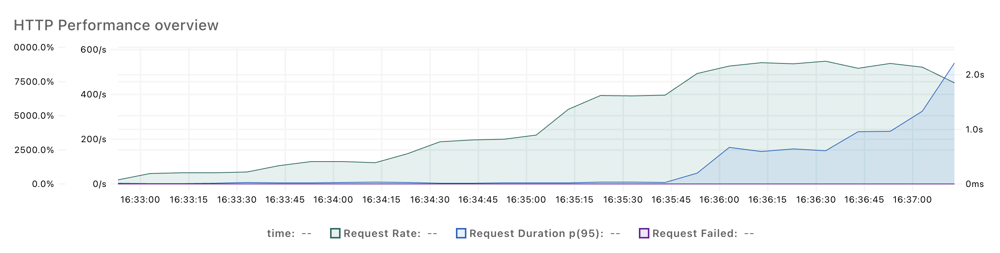    | 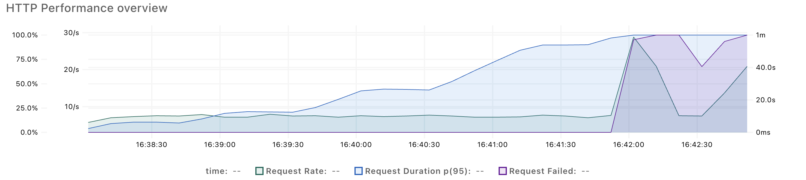 |
| Http Request Duration| 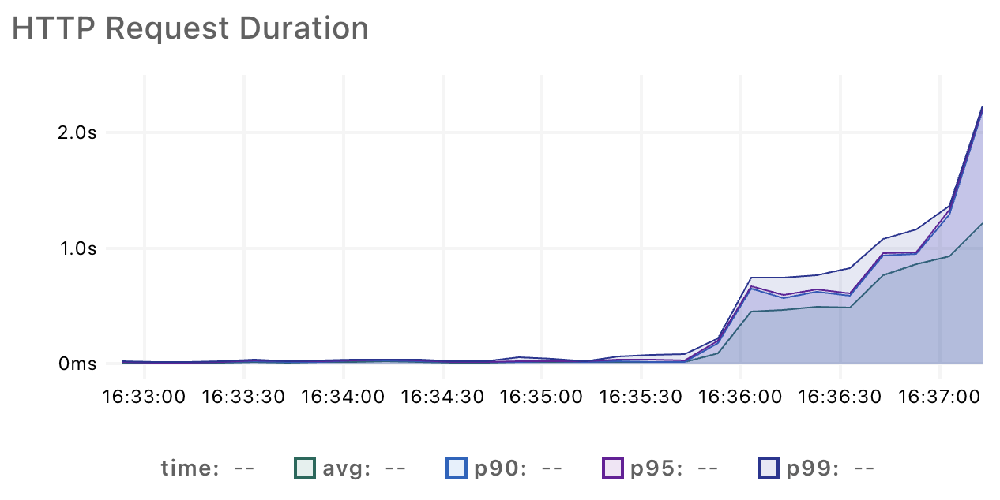   | 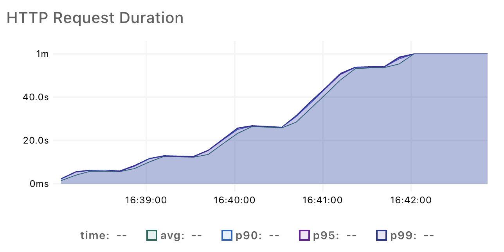 |
| VU Number            | 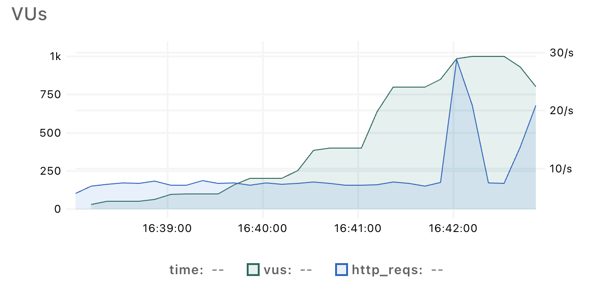                         | 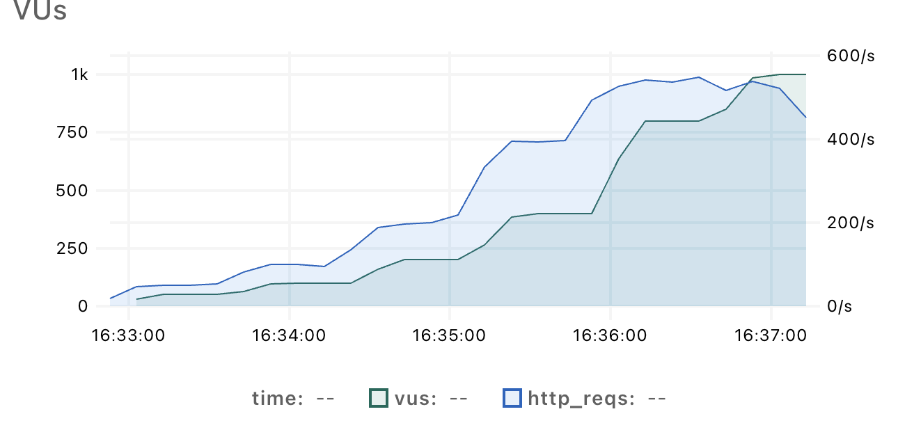                     |

### 10.4 Remaining risks and plans for future design iterations.
As shown in the stress test performed in the previous section, the microservice currently provides excellent performance and scalability outcomes. In the future, to ensure responsiveness, the growing user base of the new hiking social platform will need the implementation of even more scaling strategies. As described in [Nunes et al., 2021](#nunes), this can be improved by using both horizontal scaling (e.g. deploying more service instances or pods using Kubernetes) and vertical scaling (e.g. improving individual instances by allocating more CPU or memory—to make sure the system maintains its efficiency under increased loads).

---
## 11. Use of Artificial Intelligence

The team made use of LLMs (large language models) like ChatGPT mainly for wording, spelling corrections, rephrashing and improving clarity of concepts. Wherever the team considered an idea to be unclearly phrased AI was used to enhance the original thought process. We want to emphasize that AI was not a substitute to our own thought process, research or decision making, but rather used as an enhancer to delve deeper into topics and gain broader knowledge through suggested resources, that were at no point considered without the beforehand analysis of a member, who took responsibility to summarize the content to the rest of the team and filter it accordingly with their own thought process and background knowledge. Furthermore, Copilot was used in code completion at times to facilitate writing tests.

---
## References

<a id="wardley">[1]</a> Team, W. M. (n.d.). The four stages of evolution. Wardley Maps. https://www.wardleymaps.com/book-passages/wardley-on-evolution

<a id="wiki">[2]</a> Wikipedia contributors. (2025, September 24). Comparison of web map services. Wikipedia. https://en.wikipedia.org/wiki/Comparison_of_web_map_services

<a id="mapbox">[3]</a> Mobile maps in 3D for iOS and Android. (n.d.). https://www.mapbox.com/mobile-maps-sdk#get-started

<a id="redis-doc">[4]</a> Redis Documentation. (n.d.). *Redis Pub/Sub — Redis Documentation.* https://redis.io/docs/latest/develop/interact/pubsub/  

<a id="rest-microservices-risks">[5]</a> Solace. (2019). *Five Challenges in Implementing REST Based Microservices*. https://solace.com/blog/five-challenges-in-implementing-rest-based-microservices/

<a id="richardson">[6]</a> Richardson, C. (2018). *Microservices Patterns: With examples in Java.* Manning Publications.  

<a id="pagination">[7]</a> Gowda, P., & Gowda, A. N. (2024). *Best practices in REST API design for enhanced scalability and security.* *Journal of Artificial Intelligence, Machine Learning and Data Science, 2*(1), 827–830. https://www.researchgate.net/profile/Priyanka-Gowda-Ashwath-Narayana-Gowda-2/publication/383599280_Best_Practices_in_REST_API_Design_for_Enhanced_Scalability_and_Security/links/67a54292461fb56424cc95a0/Best-Practices-in-REST-API-Design-for-Enhanced-Scalability-and-Security.pdf 

<a id="alf-pagination-table-design">[8]</a> ALF Design Group. (2025, October 6). *Why Pagination Matters in Table Design: Improve UX, Performance & Scalability.* https://www.alfdesigngroup.com/post/why-pagination-is-important-for-table-design

<a id="odown-api-response-time">[9]</a> Ben, F. (2024, October 18; updated May 19, 2025). *API Response Time Standards: What’s Good, Bad, and Unacceptable*. Odown Blog. https://odown.com/blog/api-response-time-standards/

<a id="nunes">[10]</a> Nunes, J., Bianchi, T., Iwasaki, A., & Nakagawa, E. (2021). *State of the Art on Microservices Autoscaling: An Overview.* In *Anais do XLVIII Seminário Integrado de Software e Hardware* (pp. 30–38). Porto Alegre, RS, Brasil: SBC. https://doi.org/10.5753/semish.2021.15804